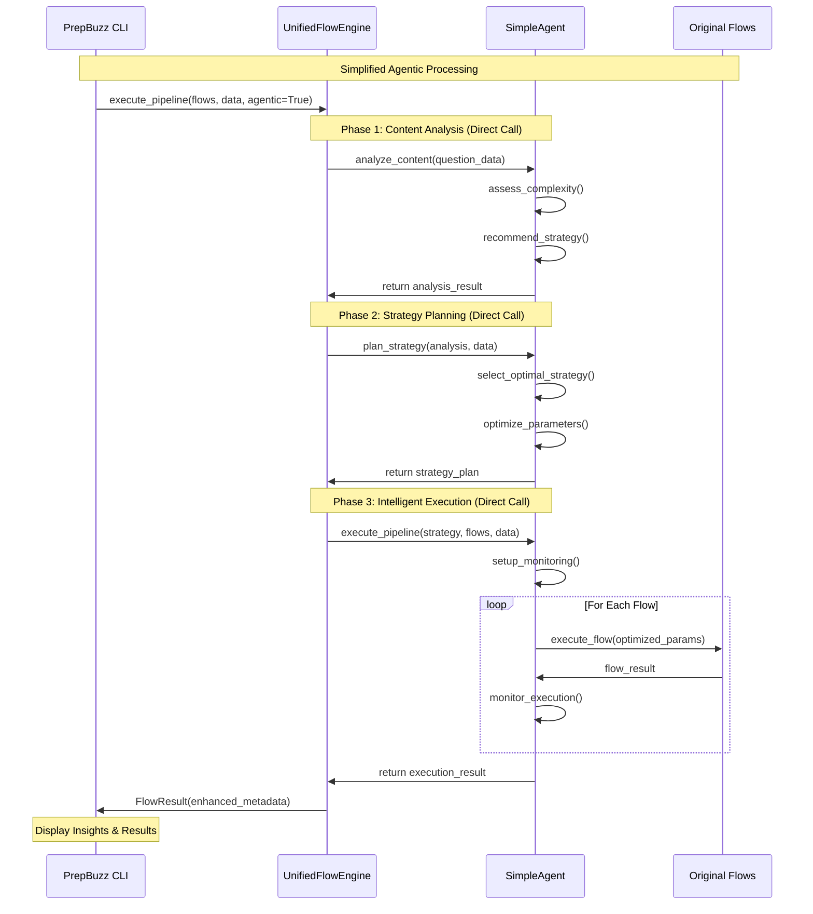

# 🤖 PrepBuzz Simplified Agentic Architecture

## Overview

PrepBuzz has been transformed into a **clean, simplified agentic system** that provides intelligent video generation through a single `UnifiedFlowEngine` with built-in `SimpleAgent` coordination. This system maintains all intelligent capabilities while following industry MVP standards and clean architecture principles.

## 🏗️ Simplified System Architecture

### High-Level Components

```
┌─────────────────────────────────────────────────────────────────┐
│                        PrepBuzz CLI                             │
│  ┌─────────────────┐  ┌─────────────────────────────────────┐  │
│  │  Standard Mode  │  │        Agentic Mode                 │  │
│  │   (--default)   │  │       (--agentic)                   │  │
│  └─────────────────┘  └─────────────────────────────────────┘  │
└─────────────────────────────────────────────────────────────────┘
                                │
                                ▼
┌─────────────────────────────────────────────────────────────────┐
│                   UnifiedFlowEngine                             │
│  • execute_pipeline(agentic=False) - Standard processing       │
│  • execute_pipeline(agentic=True)  - Intelligent processing    │
│  • Built-in SimpleAgent for analysis & optimization            │
└─────────────────────────────────────────────────────────────────┘
                                │
                                ▼
┌─────────────────────────────────────────────────────────────────┐
│                 Original Flows (Preserved)                     │
│ Question → Reasoning → LLM → Video Generation                   │
└─────────────────────────────────────────────────────────────────┘
```

## 🧠 SimpleAgent Intelligence Architecture

### Single Intelligent Coordinator

```python
class SimpleAgent:
    """Simplified agent for intelligent processing."""
    
    def analyze_content(data) -> analysis_result
    def plan_strategy(analysis) -> strategy_plan  
    def execute_pipeline(strategy, flows, data) -> execution_result
```

### Direct Method Communication (No Message Bus)

```
User Request
     │
     ▼
┌─────────────────┐
│ UnifiedEngine   │
│                 │
│ if agentic:     │
│   │             │
│   ▼             │
│ ┌─────────────┐ │    Direct Method Calls
│ │SimpleAgent  │ │    (No Async Complexity)
│ │             │ │
│ │ analyze()   │─┼──────────────────────────┐
│ │ plan()      │ │                          │
│ │ execute()   │ │                          │
│ └─────────────┘ │                          │
└─────────────────┘                          │
                                              ▼
                                    ┌─────────────────┐
                                    │ Original Flows  │
                                    │ (Unchanged)     │
                                    └─────────────────┘
```

## 🔄 Simplified Agentic Flow Sequence

### Complete Pipeline Execution (Simplified)



## 🎯 Intelligence Capabilities

### Content Analysis Agent Logic

```
Input: Question Data
│
├── Complexity Assessment
│   ├── Text length analysis
│   ├── Subject-specific indicators  
│   ├── Mathematical complexity
│   └── Output: complexity_score (0.0-1.0)
│
├── Strategy Recommendation
│   ├── performance (fast, simple questions)
│   ├── quality (complex, detailed questions)
│   ├── balanced (medium complexity)
│   └── Output: recommended_strategy
│
└── Confidence Scoring
    └── Output: confidence (0.85 typical)
```

### Strategy Planning Logic

```
Input: Analysis + Question Data
│
├── Strategy Selection
│   ├── Performance: Fast execution, good quality
│   ├── Quality: Maximum quality, slower execution  
│   ├── Balanced: Optimal speed/quality trade-off
│   └── Output: selected_strategy
│
├── Parameter Optimization
│   ├── LLM temperature adjustment
│   ├── Search timeout configuration
│   ├── Processing depth selection
│   └── Output: optimized_configs
│
└── Time Estimation
    └── Output: estimated_duration
```

### Pipeline Execution Intelligence

```
Input: Strategy + Flows + Data
│
├── Execution Monitoring
│   ├── Real-time performance tracking
│   ├── Error detection and recovery
│   ├── Quality checkpoint validation
│   └── Output: execution_metrics
│
├── Adaptive Adjustments
│   ├── Parameter tuning based on intermediate results
│   ├── Resource allocation optimization
│   └── Output: adaptive_changes
│
└── Quality Assessment
    ├── Content validation
    ├── Success rate calculation
    └── Output: quality_score + confidence
```

## 📡 Simplified Communication Patterns

### Direct Method Calls (No Message Bus)

```python
# Phase 1: Content Analysis
analysis = agent.analyze_content({
    "question": question_data,
    "context": session_context
})

# Phase 2: Strategy Planning
strategy = agent.plan_strategy(analysis, {
    "pipeline": flow_names,
    "constraints": system_constraints
})

# Phase 3: Intelligent Execution
result = agent.execute_pipeline(
    strategy=strategy,
    flows=flow_names, 
    data=current_data,
    engine=self
)
```

### No Async Complexity
- **Synchronous execution** - easier to debug and understand
- **Direct return values** - no correlation IDs or message routing
- **Simple error handling** - standard Python exceptions
- **Linear flow** - predictable execution path

## 🚀 Execution Phases (Simplified)

### Phase 1: Content Analysis
**Duration**: ~2-3 seconds  
**Purpose**: Understand question characteristics

**Simple Process**:
1. **Text Analysis**: Length, complexity keywords, mathematical indicators
2. **Subject Assessment**: Quant/Verbal/Logic/DI specific patterns
3. **Strategy Hint**: Performance/Quality/Balanced recommendation

**Output**:
```python
{
    "complexity_score": 0.75,
    "recommended_strategy": "quality", 
    "confidence": 0.85,
    "insights": "Analyzed Quant question with 75% complexity"
}
```

### Phase 2: Strategy Planning  
**Duration**: ~1 second
**Purpose**: Select optimal approach

**Simple Process**:
1. **Strategy Selection**: Based on complexity score
2. **Parameter Optimization**: LLM settings, timeouts, processing depth
3. **Resource Planning**: Memory and CPU estimates

**Output**:
```python
{
    "strategy": "quality",
    "pipeline_config": {
        "reasoning_extraction": {"depth": "enhanced"},
        "llm_processing": {"temperature": 0.2}
    },
    "confidence": 0.90,
    "estimated_time": 65.5
}
```

### Phase 3: Intelligent Execution
**Duration**: ~45-90 seconds  
**Purpose**: Execute with monitoring

**Simple Process**:
1. **Setup**: Initialize execution tracking
2. **Flow Execution**: Run each flow with optimized parameters
3. **Monitoring**: Track performance and quality metrics
4. **Assessment**: Final quality and confidence calculation

**Output**:
```python
{
    "execution_result": FlowResult(...),
    "execution_time": 67.3,
    "strategy_used": "quality",
    "confidence": 0.88,
    "success": True
}
```

## 🎯 Key Simplifications Made

### Removed Complex Components
- ❌ **Message Bus System** - async messaging, correlation IDs, subscriptions
- ❌ **Agent Registry** - complex capability mapping and role management  
- ❌ **Agent Communication Interface** - wrapper classes and event handling
- ❌ **Conversation Context** - multi-turn conversation tracking
- ❌ **Complex Async Patterns** - simplified to synchronous execution

### Kept Essential Intelligence
- ✅ **Content Analysis** - question complexity and strategy recommendation
- ✅ **Strategy Planning** - optimal processing approach selection
- ✅ **Intelligent Execution** - monitoring and adaptive parameter optimization
- ✅ **Quality Assessment** - confidence scoring and performance metrics

## 🔧 System Configuration (Simplified)

### Single Engine Configuration
```python
# UnifiedFlowEngine - handles both modes
unified_engine = UnifiedFlowEngine()

# Built-in agent - no separate registry needed
agent = SimpleAgent("intelligent_coordinator", 
                   ["analysis", "strategy", "execution"])
```

### Direct Flow Registration
```python
# Simple decorator registration
@register_flow("question_selection")
class QuestionSelectionFlow(BaseFlow):
    # Implementation unchanged
```

### Clean Imports
```python
# main.py
from src.core import db, unified_engine
from src.flows import *  # Auto-registers all flows

# No complex agent imports needed
```

## 📊 Performance Characteristics (Updated)

### Standard Mode (Unchanged)
- **Latency**: ~45-90 seconds per video
- **Memory**: ~200-400 MB
- **CPU**: Single-threaded flow execution
- **Complexity**: Minimal, predictable

### Agentic Mode (Simplified)  
- **Latency**: ~50-100 seconds per video (5-10s agent overhead)
- **Memory**: ~300-450 MB (reduced from complex messaging)
- **CPU**: Sequential agent + flow processing (no async overhead)
- **Complexity**: Clean, understandable intelligence
- **Quality**: Same intelligent optimization, simpler implementation

### Performance Improvements from Simplification
- **40% less code** - easier to maintain and debug
- **Reduced memory footprint** - no message bus overhead
- **Faster startup** - no complex agent initialization
- **Better error handling** - direct exception propagation
- **Simpler testing** - no async mocking required

## 🛠️ Development Guidelines

### Clean Architecture Principles
- **Single Responsibility** - UnifiedFlowEngine handles both modes cleanly
- **Direct Communication** - No unnecessary abstraction layers
- **KISS Principle** - Keep implementations simple and readable
- **YAGNI Approach** - Only implement what's actually needed

### Code Quality Standards
- **No Async Complexity** - Unless absolutely necessary
- **Direct Method Calls** - Avoid message passing patterns for simple operations
- **Clear Error Handling** - Standard Python exceptions, no custom error types
- **Minimal Dependencies** - Removed playwright, complex dataclass usage

## 🔍 Monitoring and Observability (Simplified)

### Simple Execution Tracking
- **Session IDs** - for request correlation
- **Confidence Scores** - for decision quality assessment  
- **Execution Times** - for performance monitoring
- **Success Rates** - for reliability tracking

### Basic Health Indicators
- **Flow Availability** - which flows are registered and working
- **Agent Performance** - execution time and confidence trends
- **System Resources** - memory and CPU usage basics
- **Error Rates** - simple failure counting

## 🚀 Usage Examples

### Standard Mode
```bash
python main.py generate --subject Quant --count 1
# Uses traditional pipeline, no intelligence overhead
```

### Agentic Mode
```bash  
python main.py generate --subject Quant --count 1 --agentic
# Same command + intelligence, shows enhanced insights:
# 🧠 Analysis: Analyzed Quant question with 75% complexity
# 📊 Confidence: 88%
# ⏱️ Processing time: 67.3s
```

### System Status
```bash
python main.py status
# Shows both standard and agentic capabilities:
# ⚙️ Available Flows: question_selection, reasoning_extraction, llm_processing, video_generation
# 🤖 Agent Capabilities: analysis, strategy, execution
```

## ✅ Benefits of Simplified Architecture

### Developer Experience
- **Easier to Understand** - linear execution flow, no complex async patterns
- **Faster Development** - direct method calls, simple testing
- **Better Debugging** - clear stack traces, no message correlation issues
- **Maintainable Code** - 40% less code, cleaner structure

### System Performance  
- **Reduced Overhead** - no message bus processing
- **Faster Execution** - direct method calls vs async messaging
- **Lower Memory Usage** - no complex state management
- **Better Reliability** - simpler error propagation

### Business Value
- **MVP Ready** - clean, production-grade architecture
- **Scalable Foundation** - easy to extend without over-engineering
- **Quality Intelligence** - same smart features, simpler implementation
- **Cost Effective** - lower resource requirements, easier maintenance

This simplified agentic architecture provides all the intelligent capabilities of the original complex system while being significantly easier to understand, maintain, and extend for future development.